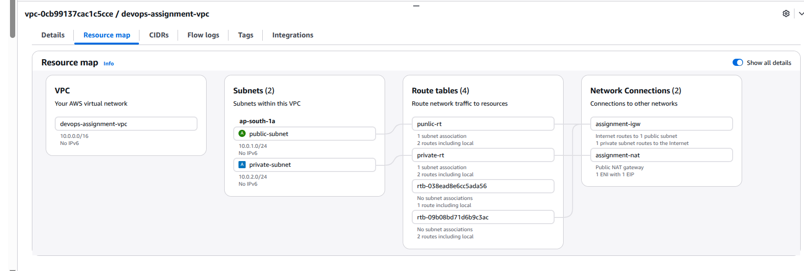
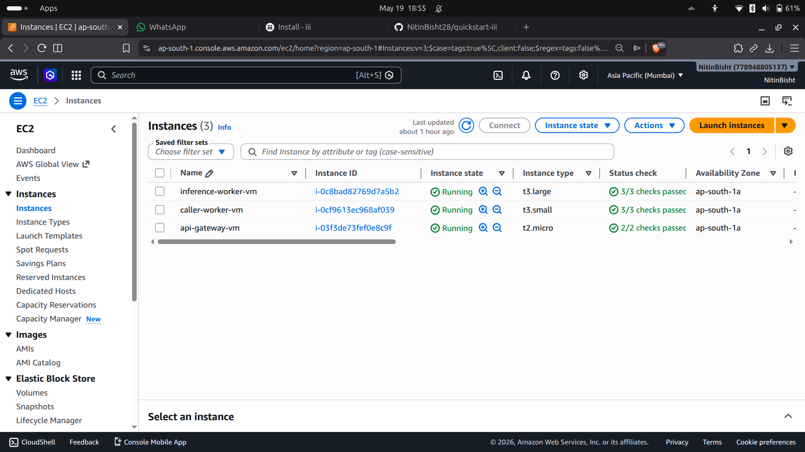
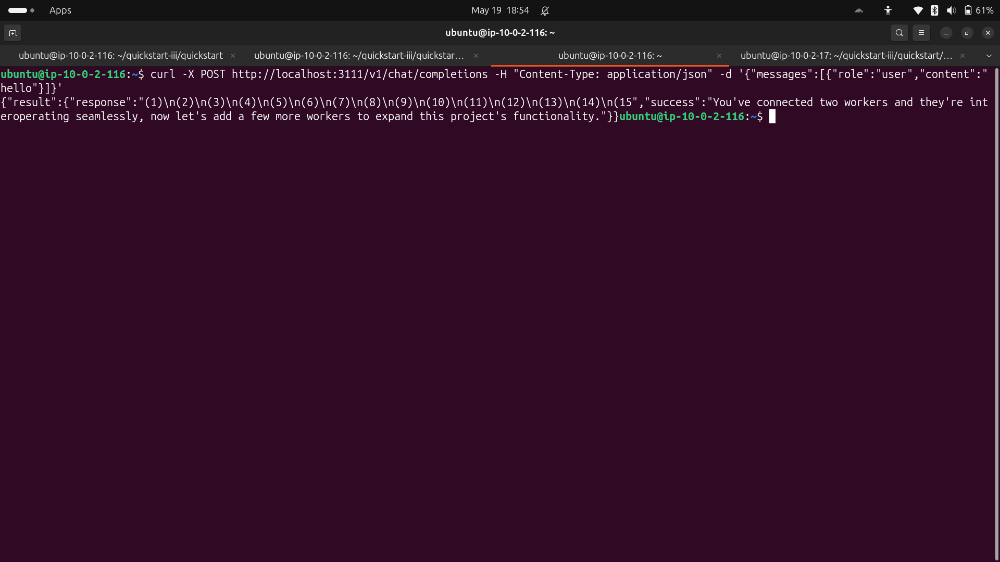
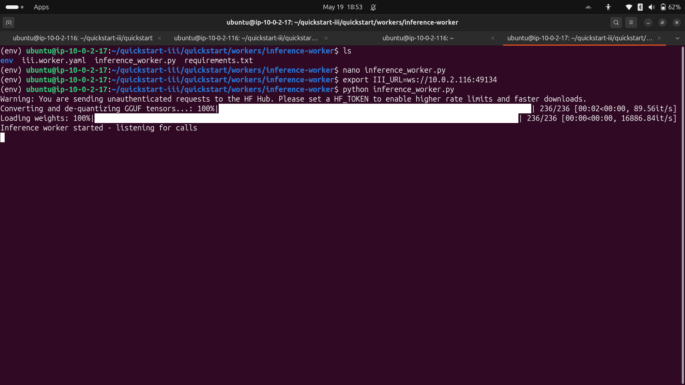
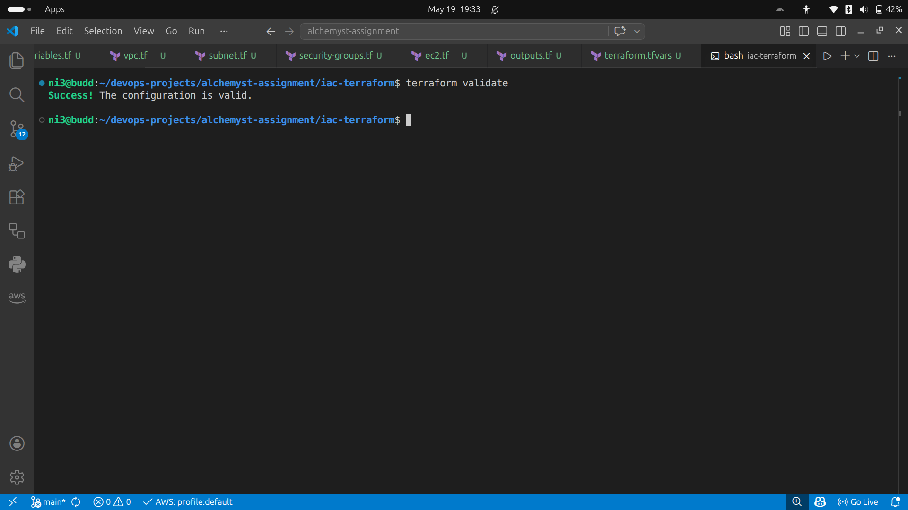
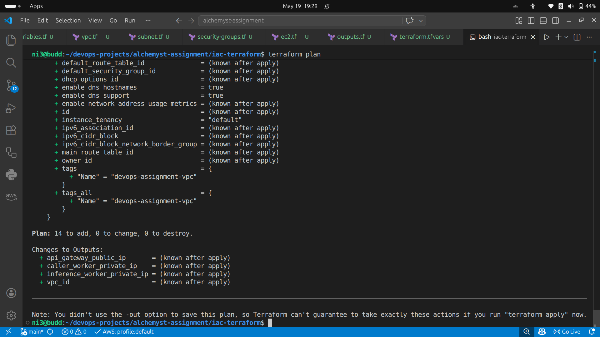

# Distributed Inference Deployment on AWS

This project demonstrates a distributed inference architecture deployed across multiple AWS EC2 virtual machines inside a secure VPC using the `iii` framework.

The deployment separates infrastructure access, API orchestration, and model inference into isolated components communicating over RPC inside a private subnet.

---

# Architecture Overview

```text
                        Internet
                            |
                +----------------------+
                |       API VM         |
                |    Public Subnet     |
                |----------------------|
                | SSH / Gateway Access |
                +----------------------+
                            |
                     Private VPC Network
                            |
        -----------------------------------------
        |                                       |
        v                                       v
+----------------------+          +----------------------+
|  caller-worker VM    |          | inference-worker VM |
|   Private Subnet     |          |   Private Subnet    |
|----------------------|          |----------------------|
| iii engine           |          | Python inference    |
| iii-http             |          | Gemma GGUF model    |
| caller-worker (TS)   |          +----------------------+
+----------------------+
```

---

# Features

* Distributed worker deployment across multiple VMs
* Private subnet isolation for worker infrastructure
* RPC communication over WebSocket
* JSON HTTP inference API
* Terraform-based infrastructure provisioning
* Automated deployment/setup scripts
* Cross-language worker communication (TypeScript + Python)
* Bastion/API VM for secure private subnet access

---

# AWS Infrastructure

The infrastructure was provisioned using Terraform.

## Components

* Custom VPC (`devops-assignment-vpc`)
* Public subnet
* Private subnet
* Internet Gateway (`assignment-igw`)
* NAT Gateway
* Route tables
* Security groups
* EC2 instances

---

# Deployment Layout

| VM                  | Role                       | Public Access |
| ------------------- | -------------------------- | ------------- |
| API VM              | Public entry / SSH gateway | Yes           |
| caller-worker VM    | iii engine + caller worker | No            |
| inference-worker VM | Model inference            | No            |

---

# Repository Structure

```text
.
├── iac-terraform/
├── images/
├── quickstart/
└── README.md
```

---

# quickstart Structure

```text
quickstart/
├── configs/
├── scripts/
├── workers/
├── iii.lock
└── README.md
```

---

# Worker Responsibilities

## caller-worker (TypeScript)

Responsible for:

* receiving HTTP requests
* dispatching RPC calls
* returning JSON responses

### Endpoint

```text
POST /v1/chat/completions
```

---

## inference-worker (Python)

Responsible for:

* loading GGUF model
* running inference
* returning generated responses

Model used:

```text
ggml-org/gemma-3-270m-GGUF
```

---

# Infrastructure Provisioning

Inside:

```text
iac-terraform/
```

run:

```bash
terraform init

terraform validate

terraform plan
```

Apply infrastructure:

```bash
terraform apply
```

---

# Runtime Deployment

Detailed runtime instructions are available in:

```text
quickstart/README.md
```

---

# API Usage

## Example Request

```bash
curl -X POST http://<PUBLIC-IP>:3111/v1/chat/completions \
-H "Content-Type: application/json" \
-d '{"messages":[{"role":"user","content":"hello"}]}'
```

---

# Example Response

```json
{
  "result": {
    "success": "You've connected two workers and they're interoperating seamlessly, now let's add a few more workers to expand this project's functionality."
  }
}
```

---

# Screenshots

## AWS VPC Resource Map



---

## EC2 Instances



---

## Successful API Response



---

## inference-worker Running



---

## Terraform Validate



---

## Terraform Plan



---

# Security Design

* Only the API VM is publicly accessible
* Both worker VMs remain private
* Internal communication occurs only inside the VPC
* Security groups restrict unnecessary inbound access
* RPC communication uses private IP addressing

Both worker VMs remain isolated inside the private subnet and are not directly reachable from the public internet. The public API VM acts as the entry point and administrative access layer for accessing the private worker infrastructure securely.

---

# Challenges Faced

During deployment several issues were encountered and resolved:

* Nested KVM limitations on EC2
* Remote worker registration debugging
* RPC communication troubleshooting
* Python dependency management
* Cross-VM worker communication setup
* Environment variable configuration for distributed workers

---

# Technologies Used

* AWS EC2
* AWS VPC
* Terraform
* TypeScript
* Python
* iii framework
* Transformers
* GGUF model format
* Linux

---

# Conclusion

This project successfully demonstrates a distributed inference deployment where infrastructure access, API orchestration, and model inference are separated across multiple AWS virtual machines communicating over RPC inside a secure private network.

The final deployment exposes a working JSON API capable of dispatching requests to a remote inference worker and returning generated responses end-to-end.
